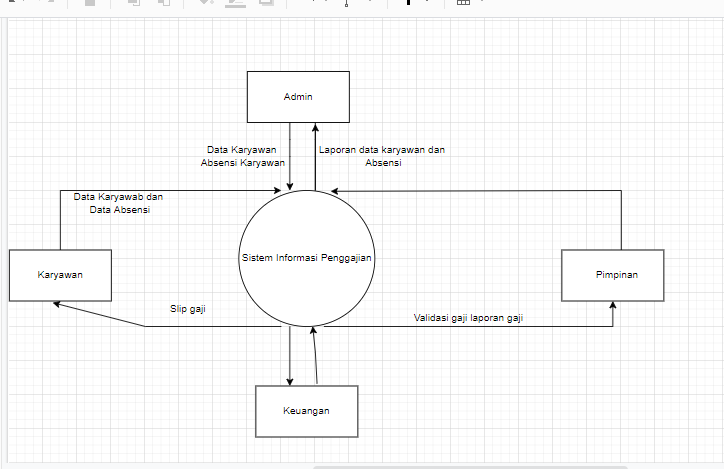
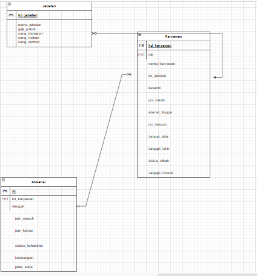

# QUIZ 

1. Berikan contoh pemanfaatan data historis

Jawaban :

## Penerapan Data Penjualan Toko Online 
Dalam menghadapi persaingan globalisasi bisnis yang tumbuh dengan pesat,
kemampuan dalam mempertahankan dan mengembangkan eksistensi suatu perusahaan
menjadi hal yang sangat penting yang harus diperhatikan oleh setiap perusahaan.
Begitupun dengan toko online, hypermarket ataupun pasar modern yang saat ini
berlomba-lomba mengambil langkah cepat dalam mengatasi persaingan yang semakin
ketat, salah satunya yakni pemanfaatan teknologi informasi yang lebih baik untuk
meningkatkan kinerja perusahaannya.
Menganalisa data penjualan dengan mengamati transaksi penjualan dan dilanjutkan
dengan melakukan pengolahan terhadap data penjualan tersebut, merupakan salah satu
langkah yang dilakukan oleh pihak management untuk memperoleh informasi ini bisa
digunakan untuk menentukan strategi pemasaran toko online dan meningkatkan
pelayanan pada konsumen

## ERD
 
