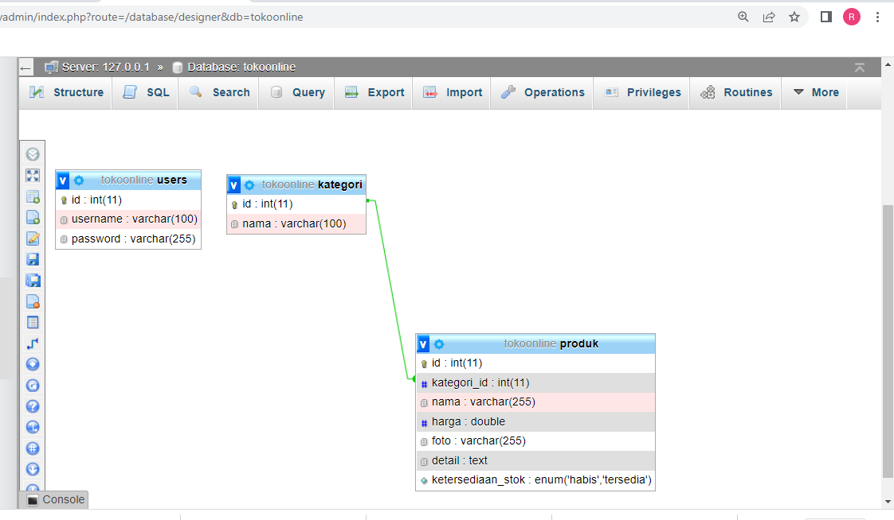

# Soal

- Jelaskan contoh-contoh perintah SQL beserta kegunaannya !
# Jawaban 

SQL atau Standard Query Language adalah bahasa pemrograman yang digunakan dalam mengakses, mengubah, dan memanipulasi data yang berbasis relasional.

Tentu saja bahasa komputer dalam data basis relasional ini berdasarkan standar yang dikeluarkan oleh American National Standard Institute (ANSI). Standardisasi SQL sudah ada sejak tahun 1986 dan memang diinisiasi oleh ANSI.

Hingga saat ini banyak server dalam sebuah database maupun software mampu mengartikan bahasa SQL. Maka dari itulah, SQL merupakan bahan pembicaraan dan sebuah materi yang sangat penting bagi kamu yang bergelut dalam dunia IT maupun hal-hal yang bersinggungan dengan database relasional.

# Jenis Perintah SQL

- Data Definition Language (DDL)

Data Definition Languange (DDL) adalah perintah yang digunakan untuk mendefinisikan data seperti membuat tabel database baru, mengubah dataset, dan menghapus data. Kemudian, perintah dasar DDL masih dibedakan lagi ke dalam setidaknya lima jenis perintah yakni bisa kamu lihat di bawah ini.

- Perintah Create: perintah untuk membuat tabel baru di dalam sebuah database adalah create. Tak cuma untuk tabel baru, tapi juga database maupun kolom baru. Kamu bisa membuat sebuah query dengan contoh ‘CREATE DATABASE nama_database.
- Perintah Alter: biasa digunakan ketika seseorang ingin mengubah struktur tabel yang sebelumnya sudah ada. Bisa jadi dalam hal ini adalah seperti nama tabel, penambahan kolom, mengubah, maupun menghapus kolom serta menambahkan atribut lainnya.
Perintah Rename: dapat kamu gunakan untuk mengubah sebuah nama di sebuah tabel ataupun kolom yang ada. Bila kamu menggunakan perintah ini maka query-nya menjadi ‘RENAME TABLE nama_tabel_lama TO nama_tabel_baru”
- Perintah Drop: Bisa kamu gunakan dalam menghapus baik itu berupa database, table maupun kolom hingga index.
- Perintah Show: perintah DDL ini digunakan untuk menampilkan sebuah tabel yang ada.

# Data Manipulation Language (DML)
Pada database SQL, perintah yang digunakan untuk memanipulasi data adalah Data Manipulation Language atau DML. Perintah dalam DML juga terbagi ke dalam empat jenis.

Beberapa di antaranya adalah insert, select, update, dan delete.

- Perintah Insert: Kamu bisa menggunakan perintah ini untuk memasukkan sebuah record baru di dalam sebuah tabel database.
- Perintah Select: Select digunakan untuk memanipulasi data dengan tujuan menampilkan maupun mengambil sebuah data pada tabel. Data yang diambil pun tidak hanya terbatas pada satu jenis saja melainkan lebih dari satu tabel dengan memakai relasi.
- Perintah update: Ini dapat kamu gunakan ketika ingin melakukan pembaruan data di sebuah tabel. Contohnya saja jika ada kesalahan ketika memasukkan sebuah record. Kamu tidak perlu menghapusnya dan bisa diperbaiki menggunakan perintah ini.
- Perintah Delete: Perintah DML ini dapat digunakan ketika kamu ingin menghapus sebuah record yang ada dalam sebuah tabel.

# Data Control Language (DCL)

Perintah dasar berikutnya adalah Data Control Language atau DCL. Perintah SQL ini digunakan khususnya untuk mengatur hak apa saja yang dimiliki oleh pengguna. Baik itu hak terhadap sebuah database ataupun pada tabel maupun field yang ada.

Melalui perintah ini, seorang admin database bisa menjaga kerahasiaan sebuah database. Terutama untuk yang penting. DCL berdasarkan perintah dasarnya terbagi dalam dua perintah utama yakni:

- Perintah Grant: Perintah ini biasanya digunakan ketika admin database ingin memberikan hak akses ke user lainnya. Tentu pemberian hak akses ini dapat dibatasi atau diatur. Dalam hal ini admin pun dapat memberikan akses mengenai perintah dalam DML di atas.
- Perintah Revoke: Kebalikannya dari Grant, Revoke terkadang sering digunakan untuk mencabut maupun menghapus hak akses seorang pengguna yang awalnya diberikan akses oleh admin database melalui perintah Grant sebelumnya.

# Fungsi SQL
Sudah tahu kan apa itu SQL? Keberadaan SQL dalam mengelola sebuah database memberikan fungsi tersendiri. Bagi seorang admin, adanya SQL dapat memungkinkan kamu untuk mengakses maupun mengubah database.

Kamu pun bisa menjalankan sebuah query maupun mengambil data yang dibutuhkan. Termasuk pula memperbarui atau menyisipkan data dalam database.

SQL juga bisa digunakan untuk menghapus sebuah data pada database. Fungsi lainnya SQL adalah untuk membuat sebuah prosedur baru dan ini akan tersimpan dalam sebuah database. Selain itu juga bisa mengatur hak akses dalam tabel, prosedur, maupun hal-hal penting lainnya.

# 2. Ide : Membuat Website Toko Online 
		

		

		# Deskripsi
		

		* Website dibuat terdiri dari 3 halaman (home,produk,tentang kami)
		* Website Terdiri dari beberapa kategori (baju pria, baju wanita, jaket, jam tangan , sepatu, kacamata, dompet)
		* Produk wajib punya 1 kategori
		* Produk mempunyai foto (boleh kosong jika belum ada )
		* Produk punya status penjelasan detail (bisa menjelaskan tentang deskripsi,ukuran , dll)
		* Produk mempunyai status ketersediaan stok (habis/tersedia).
		* Pengunjung bisa mencari produk berdasarkan nama
		* Website hanya untuk pemasaran/pameran produk pembelian hanya melalui whatsapp dan transfer bank
		* Hanya memiliki 1 akun admin untuk mengatur website (upload produk,tambah produk, kategori , dll)
		

		# Halaman Utama
		

		1. Tersedia menu pencarian produk
		2. Highlight kategori baju pria, baju wanita & sepatu
		3. Menampilkan section tentang kami 
		4. Menampilkan 6 produk dan ada tombol see more dibawahnya dan ketika diklik menuju ke halaman produk.
		5. Menampilkan social media dan Kontak whatsapp
		

		# Halaman Produk
		

		1. Secara default halaman produk menampilkan semua produk tanpa terfilter kategori.
		2. Produk bisa terfilter sesuai kategori yang terpilih
		3. Produk menampilkan foto,nama,harga dan tombol untuk menuju halaman detail produk.
		

		# Entitas & Atribut 
		

		1. Kategori
		

		- *id 
		- nama
		

		2. User 
		

		- *id_user
		- username
		- Password
		

		3. Produk 
		

		- *id_produk
		- kategori_id
		- nama (index)
		- foto (nullable)
		- detail (text)
		- ketersediaan_stok
		- harga
		

		# ERD
		

		

		# Data Base

		
		

		#  RELATIONSHIP
		

		- Users 1 1 - 1 N Kategori
		- Kategori 1 1 - 1 N Produk
		- Produk 1 1 - 1 N Kategori

-- sql

CREATE TABLE users (
	id int AUTO INCREMENTS PRIMARY KEY,
	username varchar(100)
)

-- sql

CREATE TABLE kategori(
	id int AUTO INCREMENT PRIMARY KEY,
	nama varchar(100)
)

--sql

CREATE TABLE produk(
	id int AUTO INCREMENT PRIMARY KEY,
	kategori_id int,
	nama (255),
	harga double,
	foto varchar(255) null,
	detail text,
	ketersediaan_stok enum('habis', 'tersedia') DEFAULT 'tersedia',
	INDEX (nama),
	CONSTRAINT kategori_produk
	FOREIGN KEY (kategori_id) REFERENCES kategori (id)
	ON DELETE RESTRICT
)

