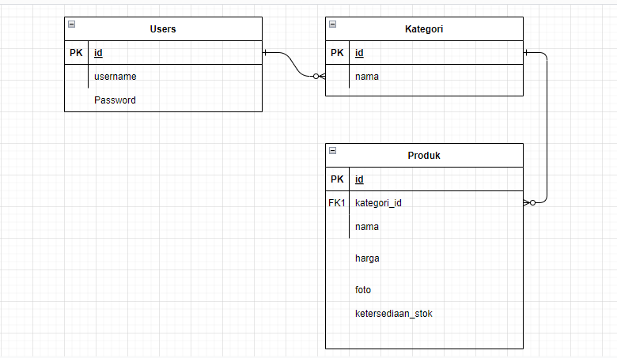

# Ide : Membuat Website Toko Online 

# Deskripsi

* Website dibuat terdiri dari 3 halaman (home,produk,tentang kami)
* Website Terdiri dari beberapa kategori (baju pria, baju wanita, jaket, jam tangan , sepatu, kacamata, dompet)
* Produk wajib punya 1 kategori
* Produk mempunyai foto (boleh kosong jika belum ada )
* Produk punya status penjelasan detail (bisa menjelaskan tentang deskripsi,ukuran , dll)
* Produk mempunyai status ketersediaan stok (habis/tersedia).
* Pengunjung bisa mencari produk berdasarkan nama
* Website hanya untuk pemasaran/pameran produk pembelian hanya melalui whatsapp dan transfer bank
* Hanya memiliki 1 akun admin untuk mengatur website (upload produk,tambah produk, kategori , dll)

# Halaman Utama

1. Tersedia menu pencarian produk
2. Highlight kategori baju pria, baju wanita & sepatu
3. Menampilkan section tentang kami 
4. Menampilkan 6 produk dan ada tombol see more dibawahnya dan ketika diklik menuju ke halaman produk.
5. Menampilkan social media dan Kontak whatsapp

# Halaman Produk

1. Secara default halaman produk menampilkan semua produk tanpa terfilter kategori.
2. Produk bisa terfilter sesuai kategori yang terpilih
3. Produk menampilkan foto,nama,harga dan tombol untuk menuju halaman detail produk.

# Entitas & Atribut 

1. Kategori

- *id 
- nama

2. User 

- *id_user
- username
- Password

3. Produk 

- *id_produk
- kategori_id
- nama (index)
- foto (nullable)
- detail (text)
- ketersediaan_stok
- harga

# Data Base

#  RELATIONSHIP

- Users 1 1 - 1 N Kategori
- Kategori 1 1 - 1 N Produk
- Produk 1  1 - 1 N Kategori